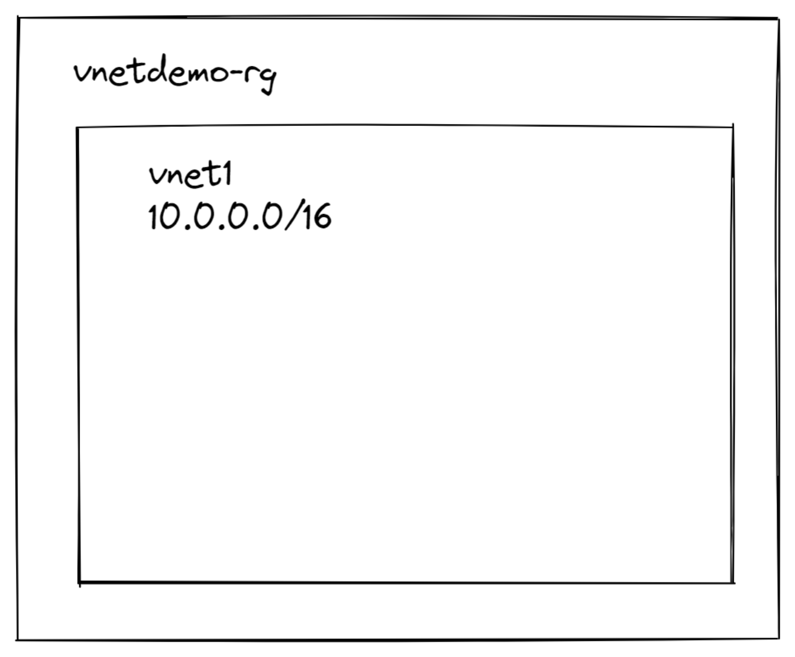
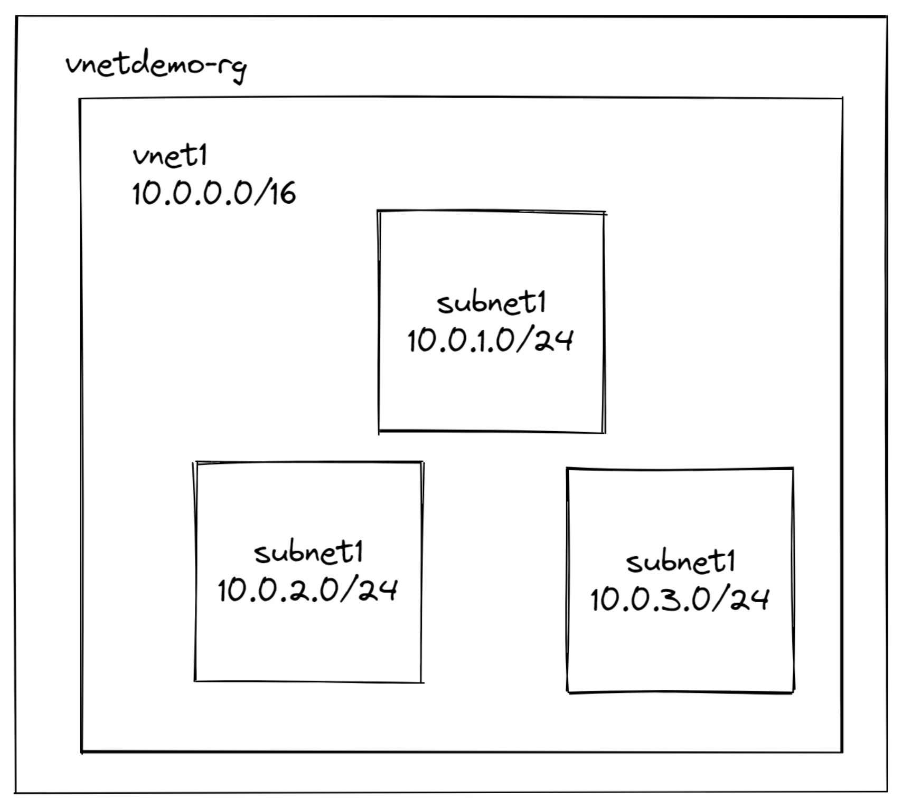
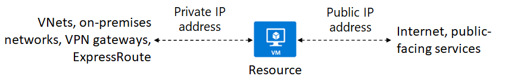
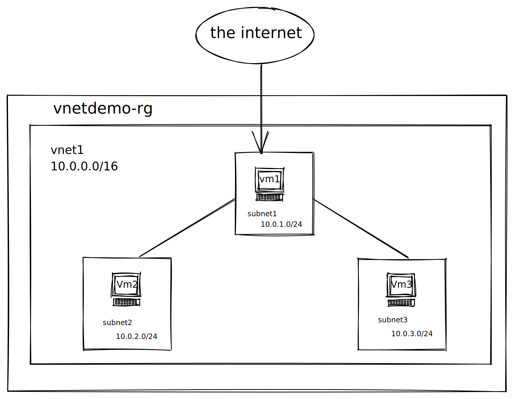

# Cómo configurar redes virtuales en Azure


Aprende más:

- [Configure virtual networks](https://docs.microsoft.com/learn/modules/configure-virtual-networks/)
- [Configure the network for your virtual machines](https://docs.microsoft.com/learn/modules/configure-network-for-azure-virtual-machines/)
- [Azure VNet FAQ](https://docs.microsoft.com/azure/virtual-network/virtual-networks-faq)
- [Azure Networking Deep Dive](https://social.technet.microsoft.com/wiki/contents/articles/52852.azure-networking-deep-dive-in-vnet-subnets.aspx)

## Casos de uso de VNet

Una red virtual de Azure (VNet) es una representación de su propia red en la nube. Es un aislamiento lógico de la nube de Azure dedicada a su suscripción.

Las redes virtuales se pueden utilizar de muchas formas:

- **Cree una red virtual exclusiva en la nube privada dedicada:** A veces, no necesita una configuración entre instalaciones para su solución. Cuando crea una red virtual, sus servicios y máquinas virtuales dentro de su red virtual pueden comunicarse de forma directa y segura entre sí en la nube. Aún puede configurar conexiones de punto final para las máquinas virtuales y los servicios que requieren comunicación por Internet, como parte de su solución.

- **Extienda de forma segura su centro de datos con redes virtuales:** Puede crear VPN tradicionales de sitio a sitio (S2S) para escalar de forma segura la capacidad de su centro de datos.

- **Habilite escenarios de nube híbrida:** Las redes virtuales le brindan la flexibilidad para admitir una variedad de escenarios de nube híbrida. Puede conectar de forma segura aplicaciones basadas en la nube a cualquier tipo de sistema local, como mainframes y sistemas Unix.



## Subredes

Las subredes proporcionan divisiones lógicas dentro de su red virtual y una red virtual se puede segmentar en una o más subredes.

Cada subred contiene un rango de direcciones IP que se encuentran dentro del espacio de direcciones de VNet.

- El rango debe ser único dentro del espacio de direcciones de la red virtual.
- El rango no puede superponerse con otros rangos de direcciones de subred dentro de la red virtual.
- El espacio de direcciones debe especificarse mediante la notación de enrutamiento entre dominios sin clases (CIDR).
- Azure reserva 5 direcciones IP dentro de cada subred. Estos son x.x.x.0-x.x.x.3 y la última dirección de la subred. x.x.x.1-x.x.x.3 está reservado en cada subred para los servicios de Azure.

    - x.x.x.0: dirección de red
    - x.x.x.1: reservado por Azure para la puerta de enlace predeterminada
    - x.x.x.2, x.x.x.3: reservado por Azure para asignar las direcciones IP de DNS de Azure al espacio de la red virtual
    - x.x.x.255: dirección de difusión de red para subredes de tamaño / 25 y superiores. Esta será una dirección diferente en subredes más pequeñas.




## IP addressing



! [texto alternativo] (img / 3.png "Título")

- **Direcciones IP privadas:** Se utilizan para la comunicación dentro de una red virtual (VNet) de Azure y su red local, cuando usa una puerta de enlace VPN o un circuito ExpressRoute para extender su red a Azure.

- **Direcciones IP públicas:** Se utilizan para la comunicación con Internet, incluidos los servicios públicos de Azure.


### Asignaciones de direcciones estáticas vs dinámicas

Las direcciones IP también se pueden asignar estáticamente o dinámicamente.

Las direcciones IP estáticas no cambian y son las mejores para ciertas situaciones como:

- Resolución de nombres DNS, donde un cambio en la dirección IP requeriría actualizar los registros del host.
- Modelos de seguridad basados ​​en direcciones IP que requieren que las aplicaciones o los servicios tengan una dirección IP estática.
- Certificados TSL / SSL vinculados a una dirección IP.
- Reglas de firewall que permiten o niegan el tráfico utilizando rangos de direcciones IP.
VM basadas en roles, como controladores de dominio y servidores DNS.

- Las direcciones dinámicas pueden cambiar cuando se desasigna el recurso.

- Las direcciones estáticas no se liberan hasta que se elimina un recurso de dirección IP pública. Si la dirección no está asociada a un recurso, puede cambiar el método de asignación después de que se crea la dirección.

## Demo

Creemos una red virtual, tres subredes, una máquina virtual en cada una, asegurémonos de que solo Vm1 tenga una IP pública y asegurémonos de que podemos RDP en todas y hacer ping a todas.




1. Crea un grupo de recursos

    ```sh
    az group create -g vnetdemo-rg -l eastu2
    ```

2. Crea una red virtual y una subred

    ```sh
    az network vnet create -g vnetdemo-rg -n Vnet1 --address-prefix 10.0.0.0/16 --subnet-name Subnet1 --subnet-prefix 10.0.0.0/24
    ```
    La salida JSON nos dará detalles de lo que acabamos de crear, que también podríamos obtener ejecutando el comando `az network vnet show`.

3. A continuación, creemos la Subred2.
    ```sh
    az network vnet subnet create --name subnet2 --vnet-name Vnet1 -g vnetdemo-rg --address-prefixes 10.0.2.0/24
    ```

    Ejecutemos una consulta para asegurarnos de que nuestra Vnet1 tenga ambas subredes asociadas.

    ```sh
    az network vnet show -g vnetdemo-rg -n Vnet1 --query "subnets"
    ``` 
4. A continuación, creemos la Subred3.
    ```sh
    az network vnet subnet create --name subnet3 --vnet-name Vnet1 -g vnetdemo-rg --address-prefixes 10.0.3.0/24
    ```

    Ejecutemos una consulta para asegurarnos de que nuestra Vnet1 tenga todas las subredes asociadas.

    ```sh
    az network vnet show -g vnetdemo-rg -n Vnet1 --query "subnets"
    ``` 

5. Crear VM1

    ``` sh
    az vm create -g vnetdemo-rg -l eastus2 --image  MicrosoftWindowsServer:WindowsServer:2016-Datacenter:latest --vnet-name demovnet1 -n vm1 --subnet Subnet1
    ```

    Dado que estamos usando una máquina virtual de Windows, el puerto 3389 se abre automáticamente cuando lo creamos.

6. Crear VM2

    ``` sh
    az vm create -g vnetdemo-rg -l eastus2 --image  MicrosoftWindowsServer:WindowsServer:2016-Datacenter:latest --vnet-name demovnet1 -n vm2 --subnet Subnet2
    ```

7. Crear VM3

    ``` sh
    az vm create -g vnetdemo-rg -l eastus2 --image  MicrosoftWindowsServer:WindowsServer:2016-Datacenter:latest --vnet-name demovnet1 -n vm2 --subnet Subnet2
    ```

8. Eliminar la IP pública de vm2

    ```sh
    az network nic ip-config update --name ipconfigvm2 -g vnetdemo-rg --nic-name vm2VMNIC --remove PublicIpAddress
    ```

    Puede usar este comando si necesita obtener la NIC de su VM.

    ```sh
    az vm nic list -g vnetdemo-rg --vm-name vm2
    ```

    Puede usar este comando si necesita obtener la configuración ip de su máquina virtual nic

    ```sh
    az network nic ip-config list --nic-name vm2VMNIC -g vnetdemo-rg -o table
    ```

9. Eliminar la IP pública de vm3

    ```sh
    az network nic ip-config update --name ipconfigvm2 -g vnetdemo-rg --nic-name vm3VMNIC --remove PublicIpAddress
    ```

    Puede usar este comando si necesita obtener la NIC de su VM.

    ```sh
    az vm nic list -g vnetdemo-rg --vm-name vm2
    ```

    Puede usar este comando si necesita obtener la configuración ip de su máquina virtual nic

    ```sh
    az network nic ip-config list --nic-name vm2VMNIC -g vnetdemo-rg -o table
    ```

10. Ahora vamos a RDP en la VM de cara al público.
11. A continuación, hagamos ping a VM2 y VM3 desde VM1.
12. A continuación, utilicemos RDP en VM2 desde VM1.
13. Finalmente, utilicemos RDP en VM3 desde VM2.